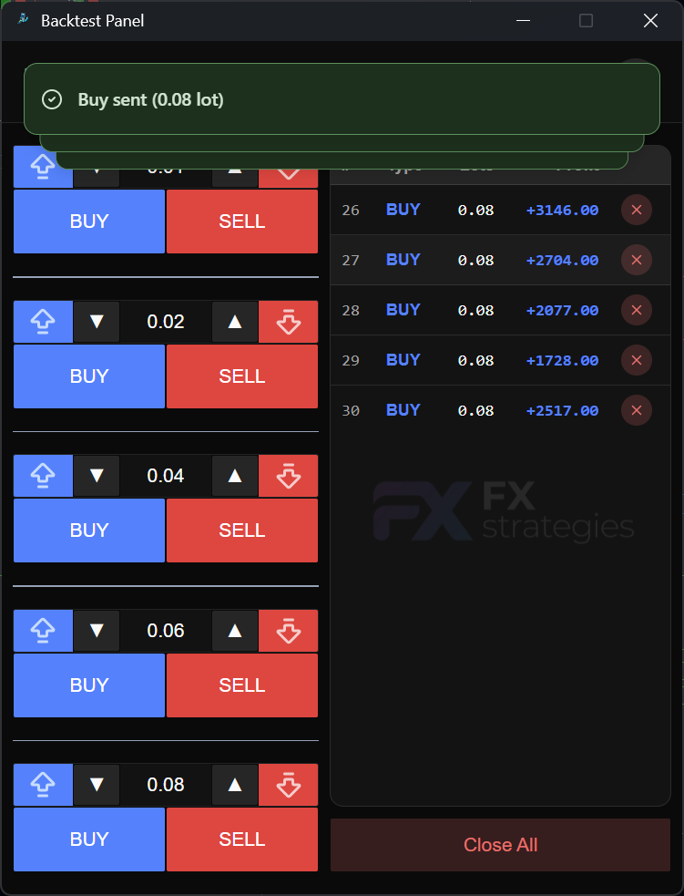
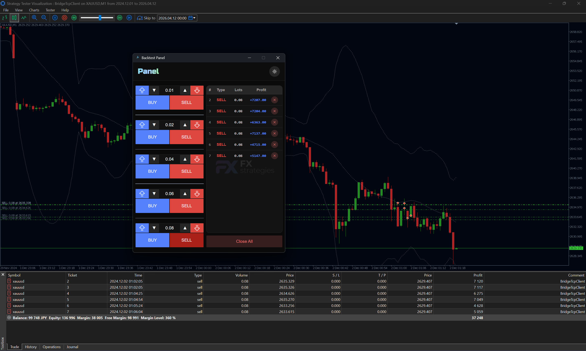

# BackTestPanel



BackTestPanel is a Windows desktop panel for controlling MetaTrader 5 Strategy Tester trades from outside the tester chart. It runs a local TCP server, receives position snapshots from a MetaTrader bridge EA, and sends commands such as buy, sell, close one position, and close all positions.

## Languages

- [English](#english)
- [日本語](#日本語)
- [Português](#português)

---

## English

### Why this exists

When testing indicator-based strategies in MetaTrader 5, the Strategy Tester is restrictive for interactive tooling. Native chart interaction is limited, custom chart events are not generated in tester visual mode, and built-in network functions such as `WebRequest()` and MQL5 socket functions are not executed in the tester.

BackTestPanel works around that testing gap with two parts:

- `BackTestPanel_VX.Y.Z.exe`: the external Windows panel and local TCP server.
- `BridgeTcpClient.ex5`: the MetaTrader 5 Expert Advisor that receives panel commands and executes trades in the tester.



### How it works

The panel opens a local TCP server at `127.0.0.1:47001`. The MT5 bridge connects to that server, sends position snapshots, and waits for line-based commands.

Supported bridge commands:

| Command | Purpose |
| --- | --- |
| `buy` | Opens a buy position using `CTrade.Buy()` |
| `sell` | Opens a sell position using `CTrade.Sell()` |
| `close_position` | Closes a position by ticket or symbol |
| `close_all` | Closes all positions, optionally filtered by symbol |

The bridge publishes position updates as `type=positions` messages, so the panel can display the current tester state.

### Required MT5 files

The project depends on the files in [`resources`](resources):

| File | Use |
| --- | --- |
| [`resources/BridgeTcpClient.ex5`](resources/BridgeTcpClient.ex5) | Compiled EA to attach to the Strategy Tester. This file is also published in every GitHub release. |
| [`resources/BridgeTcpClient.mq5`](resources/BridgeTcpClient.mq5) | Source code for the bridge EA. |
| [`resources/TCPClient.mqh`](resources/TCPClient.mqh) | TCP client include used by the bridge. It imports Windows Winsock functions from `ws2_32.dll`. |

### MT5 setup

1. Download `BackTestPanel_VX.Y.Z.exe` and `BridgeTcpClient.ex5` from the release.
2. Copy `BridgeTcpClient.ex5` into your MetaTrader 5 `MQL5/Experts` folder.
3. Start BackTestPanel.
4. Open Strategy Tester in MetaTrader 5.
5. Select `BridgeTcpClient` as the Expert Advisor, enable visual mode if desired, and run the test.
6. In the EA inputs, keep the defaults unless you changed the panel TCP settings:
   - `InpServerHost`: `127.0.0.1`
   - `InpServerPort`: `47001`
   - `InpTesterOnly`: `true`
7. Enable **Allow DLL imports** for the tested EA.

### Why DLL imports are required

`TCPClient.mqh` imports `ws2_32.dll`, the Windows Winsock 2 library. Winsock is the standard Windows networking API used for socket operations such as startup, socket creation, connect, send, receive, and cleanup. The bridge calls functions such as `WSAStartup`, `socket`, `connect`, `send`, `recv`, `closesocket`, and `WSACleanup` to communicate with the external panel.

This is necessary because MQL5 built-in network functions are restricted in the Strategy Tester. Official MQL5 documentation notes that `WebRequest()` cannot be executed in the Strategy Tester, and the MQL5 Algo Book states that functions that interact with the outside world, including socket functions, are not executed in the tester. MT5 does allow DLL calls on local tester agents only when **Allow DLL imports** is enabled; remote agents forbid DLL calls for security reasons.

### Build

```powershell
.venv\Scripts\python.exe -m src.scripts.build --version 0.1.0
```

The onefile executable is created as:

```text
dist/BackTestPanel_V0.1.0.exe
```

### Release

Pushing a tag in the `vX.Y.Z` format builds the Windows onefile executable and creates a GitHub release with both assets:

- `BackTestPanel_VX.Y.Z.exe`
- `BridgeTcpClient.ex5`

```powershell
git tag v0.1.0
git push origin v0.1.0
```

### References

- [MQL5 Network functions](https://www.mql5.com/en/docs/network)
- [MQL5 WebRequest](https://www.mql5.com/en/docs/network/webrequest)
- [MQL5 Strategy Tester limitations](https://www.mql5.com/en/book/automation/tester/tester_limitations)
- [MQL5 Using DLLs in testing](https://www.mql5.com/en/docs/runtime/testing#dll)
- [MQL5 importing DLL functions](https://www.mql5.com/en/docs/basis/preprosessor/import)
- [Microsoft WSAStartup / Winsock](https://learn.microsoft.com/en-us/windows/win32/api/winsock/nf-winsock-wsastartup)

---

## 日本語

### このプロジェクトの目的

MetaTrader 5 でインジケーターを使った戦略をテストする場合、Strategy Tester では対話的な操作に制限があります。テスターのビジュアルモードではカスタムチャートイベントが生成されず、`WebRequest()` や MQL5 のソケット関数のような組み込みネットワーク機能もテスター内では実行されません。

BackTestPanel は、その制限を回避するための外部パネルです。

- `BackTestPanel_VX.Y.Z.exe`: Windows 用の外部パネルとローカル TCP サーバー。
- `BridgeTcpClient.ex5`: パネルからの注文コマンドを受け取り、Strategy Tester 内で売買を実行する MT5 Expert Advisor。


### 仕組み

パネルは `127.0.0.1:47001` でローカル TCP サーバーを起動します。MT5 側の bridge EA がそのサーバーへ接続し、ポジション情報を送信しながら、パネルからのコマンドを待ち受けます。

対応コマンド:

| コマンド | 内容 |
| --- | --- |
| `buy` | `CTrade.Buy()` で買いポジションを開く |
| `sell` | `CTrade.Sell()` で売りポジションを開く |
| `close_position` | チケットまたはシンボルでポジションを決済 |
| `close_all` | すべてのポジションを決済。シンボル指定も可能 |

### 必要な MT5 ファイル

このプロジェクトは [`resources`](resources) フォルダー内のファイルに依存します。

| ファイル | 用途 |
| --- | --- |
| [`resources/BridgeTcpClient.ex5`](resources/BridgeTcpClient.ex5) | Strategy Tester にセットするコンパイル済み EA。GitHub release にも含まれます。 |
| [`resources/BridgeTcpClient.mq5`](resources/BridgeTcpClient.mq5) | bridge EA のソースコード。 |
| [`resources/TCPClient.mqh`](resources/TCPClient.mqh) | bridge が使用する TCP クライアント include。Windows の `ws2_32.dll` を import します。 |

### MT5 の設定

1. Release から `BackTestPanel_VX.Y.Z.exe` と `BridgeTcpClient.ex5` をダウンロードします。
2. `BridgeTcpClient.ex5` を MetaTrader 5 の `MQL5/Experts` フォルダーへコピーします。
3. BackTestPanel を起動します。
4. MetaTrader 5 の Strategy Tester を開きます。
5. Expert Advisor として `BridgeTcpClient` を選択し、必要に応じて visual mode を有効にしてテストを開始します。
6. EA input は通常デフォルトのままで使えます。
   - `InpServerHost`: `127.0.0.1`
   - `InpServerPort`: `47001`
   - `InpTesterOnly`: `true`
7. テストする EA の設定で **Allow DLL imports** を有効にします。

### DLL import が必要な理由

`TCPClient.mqh` は Windows の Winsock 2 ライブラリである `ws2_32.dll` を import します。Winsock は Windows の標準ネットワーク API で、ソケット初期化、接続、送信、受信、終了処理などを提供します。この bridge は `WSAStartup`, `socket`, `connect`, `send`, `recv`, `closesocket`, `WSACleanup` などを使って外部パネルと通信します。

MQL5 の組み込みネットワーク機能は Strategy Tester 内で制限されるため、この設計になっています。公式ドキュメントでは `WebRequest()` は Strategy Tester で実行できないとされ、MQL5 Algo Book でも外部世界と通信する関数、ソケット関数を含む処理はテスターで実行されないと説明されています。ローカル tester agent では **Allow DLL imports** を有効にした場合のみ DLL 呼び出しが許可され、remote agent ではセキュリティ上禁止されています。

### ビルド

```powershell
.venv\Scripts\python.exe -m src.scripts.build --version 0.1.0
```

生成される onefile:

```text
dist/BackTestPanel_V0.1.0.exe
```

### Release

`vX.Y.Z` 形式の tag を push すると、GitHub Actions が Windows onefile をビルドし、次の 2 つの asset を release に追加します。

- `BackTestPanel_VX.Y.Z.exe`
- `BridgeTcpClient.ex5`

---

## Português

### Motivação

Ao testar uma estratégia com indicadores no MetaTrader 5, o Strategy Tester bloqueia várias formas de interação direta. Em modo de teste, não é prático criar um painel MQL5 interativo, os eventos customizados de chart não são gerados no visual tester, e as funções nativas de rede do MQL5, como `WebRequest()` e sockets, não são executadas no tester.

O BackTestPanel nasceu para resolver esse ponto: controlar compras, vendas e fechamentos por um painel externo enquanto o teste roda no MetaTrader 5.

- `BackTestPanel_VX.Y.Z.exe`: painel externo para Windows e servidor TCP local.
- `BridgeTcpClient.ex5`: Expert Advisor do MetaTrader 5 que recebe os comandos do painel e executa as operações no Strategy Tester.


### Como funciona

O painel abre um servidor TCP local em `127.0.0.1:47001`. O EA `BridgeTcpClient` conecta nesse servidor, envia snapshots das posições abertas e recebe comandos em texto.

Comandos suportados:

| Comando | Função |
| --- | --- |
| `buy` | Abre uma compra usando `CTrade.Buy()` |
| `sell` | Abre uma venda usando `CTrade.Sell()` |
| `close_position` | Fecha uma posição por ticket ou símbolo |
| `close_all` | Fecha todas as posições, com filtro opcional por símbolo |

As posições são enviadas pelo bridge com mensagens `type=positions`, permitindo que o painel mostre o estado atual do teste.

### Arquivos necessários do MetaTrader 5

O uso do painel depende dos arquivos da pasta [`resources`](resources):

| Arquivo | Uso |
| --- | --- |
| [`resources/BridgeTcpClient.ex5`](resources/BridgeTcpClient.ex5) | EA compilado para colocar no Strategy Tester. Também fica disponível para download em toda release. |
| [`resources/BridgeTcpClient.mq5`](resources/BridgeTcpClient.mq5) | Código-fonte do EA bridge. |
| [`resources/TCPClient.mqh`](resources/TCPClient.mqh) | Include do cliente TCP. Ele usa `#import "ws2_32.dll"` para acessar sockets do Windows. |

### Como usar no MT5

1. Baixe `BackTestPanel_VX.Y.Z.exe` e `BridgeTcpClient.ex5` na release.
2. Copie `BridgeTcpClient.ex5` para a pasta `MQL5/Experts` do MetaTrader 5.
3. Abra o BackTestPanel.
4. Abra o Strategy Tester no MetaTrader 5.
5. Selecione `BridgeTcpClient` como Expert Advisor, ative o visual mode se desejar, e inicie o teste.
6. Nos inputs do EA, mantenha os padrões se o painel estiver local:
   - `InpServerHost`: `127.0.0.1`
   - `InpServerPort`: `47001`
   - `InpTesterOnly`: `true`
7. Nas configurações do teste/EA, habilite **Allow DLL imports**.

### Por que a DLL é necessária

O arquivo `TCPClient.mqh` usa a DLL do Windows `ws2_32.dll`, que implementa o Winsock 2. Winsock é a API padrão do Windows para comunicação por sockets TCP/IP. No bridge, ela é usada para inicializar a pilha de rede (`WSAStartup`), criar socket (`socket`), conectar (`connect`), enviar (`send`), receber (`recv`), fechar (`closesocket`) e liberar recursos (`WSACleanup`).

Essa abordagem é necessária porque as funções nativas de rede do MQL5 não funcionam no Strategy Tester. A documentação oficial informa que `WebRequest()` não pode ser executada no Strategy Tester, e o MQL5 Algo Book explica que funções que interagem com o mundo externo, incluindo sockets, não são executadas no tester. No agente local, chamadas de DLL são permitidas somente com **Allow DLL imports** habilitado; em agentes remotos, DLLs são proibidas por segurança.

### Build local

```powershell
.venv\Scripts\python.exe -m src.scripts.build --version 0.1.0
```

O executável onefile será criado em:

```text
dist/BackTestPanel_V0.1.0.exe
```

### Release

Ao publicar uma tag no formato `vX.Y.Z`, o GitHub Actions compila o Windows onefile e cria uma release com:

- `BackTestPanel_VX.Y.Z.exe`
- `BridgeTcpClient.ex5`

```powershell
git tag v0.1.0
git push origin v0.1.0
```
